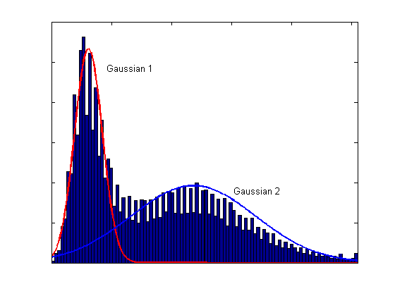

# Compara README.org and README.md  

## Embed html

   
## Latex Formula
 
*Not suported*
    
$\text{S}_1(N) = \sum_{p=1}^N \text{E}(p)$

\text{S}_1(N) = \sum_{p=1}^N \text{E}(p)$

$
\boldsymbol\Sigma = \begin{bmatrix}
\sigma^2(x_1) & cov(x_2,x_1) \\
cov(x_1,x_2) &  \sigma^2(x_2)
\end{bmatrix}
$

## Links

[README.org](README.org)
  
